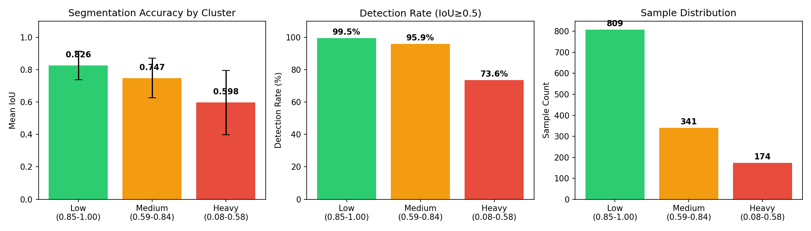
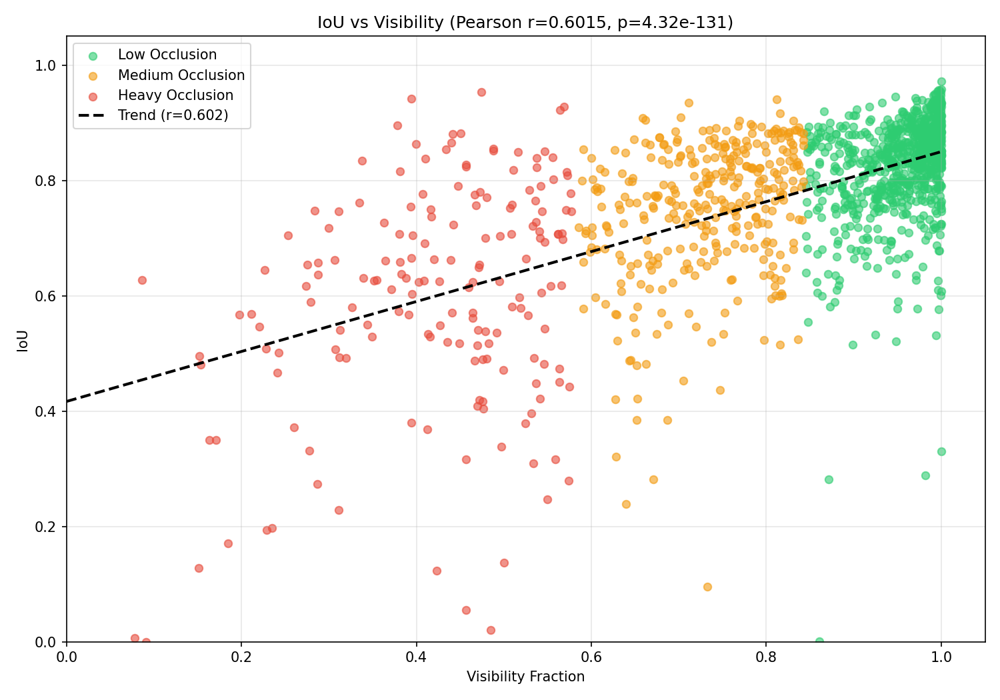
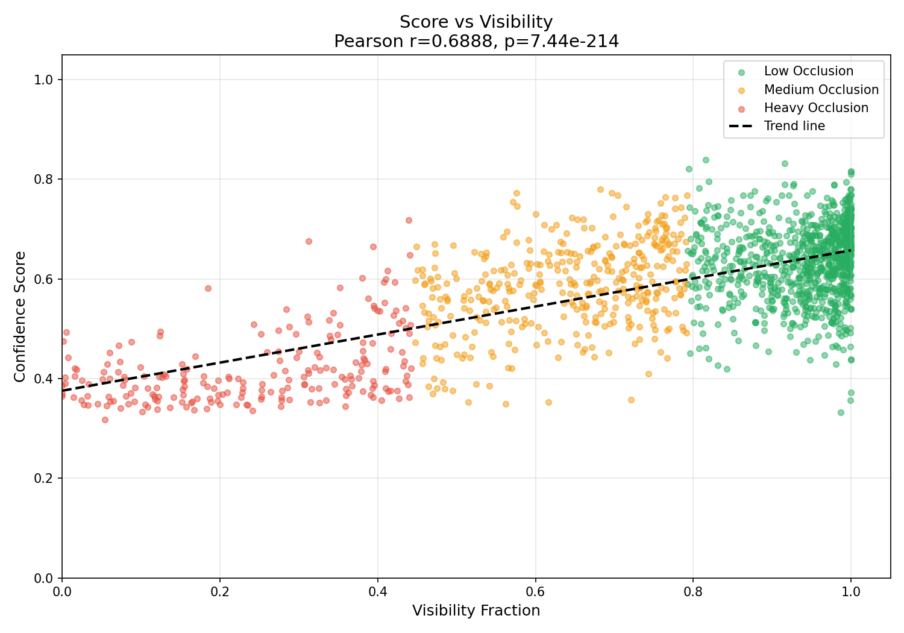
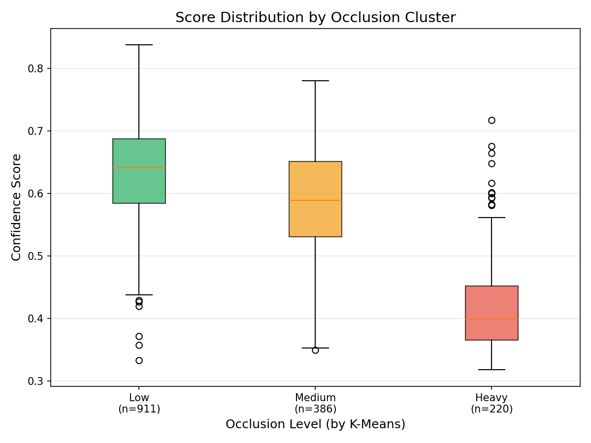

# Task 2: Segmentation Accuracy vs Occlusion
**Dataset**: LM-O (Linemod-Occluded) from BOP Challenge

## Occlusion Clustering (K-Means)
We used **K-Means clustering (k=3)** to automatically partition objects into three occlusion groups:
| Cluster | Visibility Range | Cluster Center | Interpretation |
|---------|------------------|----------------|----------------|
| **Low Occlusion** | 0.85 - 1.00 | 0.956 | Object mostly visible |
| **Medium Occlusion** | 0.59 - 0.84 | 0.734 | Partial occlusion |
| **Heavy Occlusion** | 0.08 - 0.58 | 0.424 | Significant occlusion |

## Segmentation Accuracy by Occlusion Level
| Occlusion Level | Sample Count | Mean IoU | Std IoU | Detection Rate |
|-----------------|--------------|----------|---------|----------------|
| **Low** | 809 | 0.8258 | ±0.0875 | 99.5% |
| **Medium** | 341 | 0.7474 | ±0.1223 | 95.9% |
| **Heavy** | 174 | 0.5975 | ±0.1984 | 73.6% |

**Clear Performance Degradation**: Segmentation accuracy drops significantly as occlusion increases:
   - Low → Medium: **-9.5%** IoU decrease
   - Medium → Heavy: **-20.0%** IoU decrease
   - Total degradation (Low → Heavy): **-27.6%** IoU

## Correlation Analysis

| Correlation Type | Coefficient (r) | p-value | Interpretation |
|------------------|-----------------|---------|----------------|
| **Pearson** | 0.6015 | 4.32e-131 | Strong positive correlation |
| **Spearman** | 0.5551 | 7.23e-108 | Strong monotonic relationship |

There is a statistically significant **positive correlation** between occlusion and segmentation accuracy. The Pearson correlation coefficient of **r = 0.60** with an extremely small p-value (p < 10⁻¹³⁰) confirms that:

## Visualizations

# Task 3: Pose Estimation Accuracy vs Occlusion
**Dataset**: LM-O (Linemod-Occluded) from BOP Challenge

## Occlusion Clustering (K-Means)
We used **K-Means clustering (k=3)** to automatically partition objects into three occlusion groups:

| Cluster | Cluster Center | Interpretation |
|---------|----------------|----------------|
| **Low Occlusion** | 0.941 | Object almost fully visible |
| **Medium Occlusion** | 0.643 | Partial occlusion |
| **Heavy Occlusion** | 0.245 | Significant occlusion (>75% hidden) |

## Pose Estimation Accuracy by Occlusion Level

| Occlusion Level | Sample Count | Mean Score | Std Score | High Conf (>0.5) | Very High Conf (>0.7) |
|-----------------|--------------|------------|-----------|------------------|----------------------|
| **Low** | 911 | 0.6346 | ±0.0753 | 95.8% | 19.2% |
| **Medium** | 386 | 0.5859 | ±0.0872 | 84.7% | 9.6% |
| **Heavy** | 220 | 0.4191 | ±0.0725 | 14.5% | 0.5% |

**Dramatic Performance Degradation**: Pose estimation confidence drops significantly as occlusion increases:
   - Low → Medium: **-7.7%** score decrease (0.6346 → 0.5859)
   - Medium → Heavy: **-28.5%** score decrease (0.5859 → 0.4191)
   - Total degradation (Low → Heavy): **-34.0%** score decrease

## Correlation Analysis

| Correlation Type | Coefficient (r) | p-value | Interpretation |
|------------------|-----------------|---------|----------------|
| **Pearson** | 0.6888 | 7.44e-214 | Strong positive correlation |
| **Spearman** | 0.5461 | 1.23e-118 | Strong monotonic relationship |

There is a strong statistically significant **positive correlation** between object visibility and pose estimation accuracy. The Pearson correlation coefficient of **r = 0.69** (even stronger than segmentation's r = 0.60) with an extremely small p-value (p < 10⁻²¹³) confirms that:

## Visualizations

## Comparison with Task 2 (Segmentation)

| Metric | Task 2 (Segmentation) | Task 3 (Pose Estimation) |
|--------|----------------------|--------------------------|
| Pearson r | 0.6015 | **0.6888** (stronger) |
| Low → Heavy degradation | 27.6% | **34.0%** (more severe) |
| High Conf Rate drop | 25.9 pp | **81.3 pp** (catastrophic) |

Pose estimation is **more sensitive to occlusion** than segmentation. 